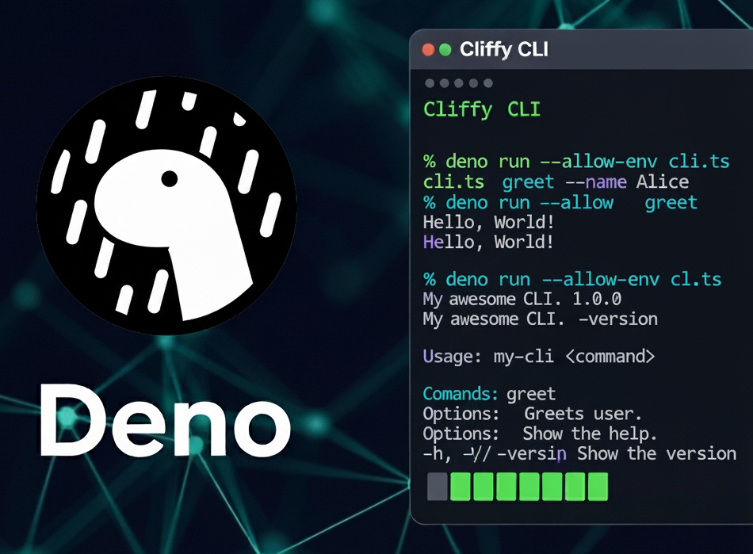

import URL from "@site/src/components/URL";
import JoinComm from "@site/src/components/JoinComm";

<br/>
<div align="center">



</div>

## <span className="color-section">The Deno and Cliffy Marriage: A Match Made in Heaven</span>

Creating a robust command-line interface (CLI) used to be a daunting task, fraught with the complexities of bundling, dependency management, and distribution. Today, using the Deno runtime/platform, you can simplify this process by using the powerful combination of Deno and Cliffy.

Deno, the secure JavaScript/TypeScript runtime, brings a modern, permission-based approach to the table. Cliffy, a powerful command-line framework for Deno, provides an elegant and intuitive way to build sophisticated CLIs. Together, they create a development environment that is not only productive but also highly secure and easy to manage.

{/* truncate */}

## <span className="color-section">Why Deno? A Modern Runtime for a Modern World</span>

Deno distinguishes itself from other runtimes with its focus on security and developer experience.
- **Secure by Default:** Deno runs scripts in a secure sandbox, meaning they have no access to your file system, network, or environment variables unless explicitly granted. This permission-based model dramatically reduces the risk of malicious scripts.
- **TypeScript-First:** Deno has native TypeScript support, eliminating the need for complex build steps. This allows you to write type-safe code from the get-go, catching potential errors before they become problems.
- **Built-in Tooling:** Deno comes with a suite of built-in tools—a test runner, a bundler, a formatter, and a linter—that enhance developer productivity.


## <span className="color-section">Why Cliffy? The CLI Framework You've Been Waiting For</span>

Cliffy is a powerful and flexible framework for building CLIs. It’s designed to be intuitive and easy to use, while still providing all the features you need for complex applications.
- **Declarative API:** Cliffy’s API is simple and expressive. You can define your CLI commands, options, and arguments in a clear, readable way.
- **Powerful Features:** Cliffy supports a wide range of features, including command chaining, subcommands, custom help messages, and interactive prompts.
- **First-class TypeScript Support:** Being a Deno framework, Cliffy seamlessly integrates with TypeScript. This means you get excellent autocompletion and type-checking, making your development process smoother.


## <span className="color-section">Getting Started: Your First Deno and Cliffy CLI</span>

Let's walk through a simple example to see how easy it is to get started.  
First, you'll need Deno installed. If you don't have it yet, you can get it from the [Deno website](https://deno.land/).

Create a new file, `cli.ts`, and add the following code:

```ts
import { Command } from "jsr:@cliffy/command@1.0.0-rc.8";

// Create a new command
const greetCommand = new Command()
    .name("greet")
    .description("Greets the user.")
    .option("-n, --name <name:string>", "The name to greet.", {
        default: "World",
    })
    .action(({ name }) => {
        console.log(`Hello, ${name}!`);
    });

// Create a main command and register the greet command
await new Command()
    .name("my-cli")
    .description("My awesome CLI.")
    .version("1.0.0")
    .command("greet", greetCommand)
    .parse(Deno.args);
```

To run this CLI, simply execute it with Deno:

```bash
deno run --allow-all cli.ts greet --name "Alice"
# Output: Hello, Alice!
```

You can also try it without the name option:

```bash
deno run --allow-all cli.ts greet
# Output: Hello, World!
```

Notice the `--allow-all` flag. For this simple example, we're not accessing any sensitive resources, but it's a good practice to be explicit about the permissions your script needs.

For more information and documentation, you can visit the [Cliffy website](https://cliffy.io/).


## <span className="color-section">Why the Combo is a Game-Changer</span>

The Deno and Cliffy combination fundamentally changes how we approach CLI development.
- **No more `node_modules`:** Deno's native module system eliminates the need for the sprawling `node_modules` directory. Dependencies are managed and cached internally, leading to a cleaner project structure.
- **Single-file Distribution:** Deno can bundle your entire application into a single executable file, which simplifies distribution. No more worrying about users having the right runtime version or managing dependencies.
- **Enhanced Security:** Deno's permission-based model provides a level of security that is difficult to achieve with other runtimes.


## <span className="color-section">What's Next for Deno and Cliffy?</span>

The Deno ecosystem is evolving at a rapid pace. New functionalities are continuously being added, including direct text/binary file imports, a `--preload` flag, and stabilized OpenTelemetry integration.
While there may not be a formal "Cliffy roadmap," its future is tied to Deno’s ongoing development. Cliffy is maintained by a dedicated developer and is cross-platform compatible (Deno, Node.js, Bun). It will undoubtedly evolve and flourish alongside Deno.


## <span className="color-section">Conclusion: Build Your Next CLI with Confidence</span>

Deno and Cliffy represent a paradigm shift in CLI development, providing a modern, secure, and highly productive environment. The learning curve is manageable, and the advantages—enhanced security, a delightful developer experience, and effortless distribution—are undeniable.
Whether you are an experienced developer or a newcomer to the world of command-line interfaces, Deno and Cliffy are a combination worth exploring for your next masterpiece. Embrace the future of CLI development.


If you have any questions, want to chat, or contribute to any of my open-source projects, feel free to reach out
to me on our discord channel or X located at the top right.

<JoinComm />
