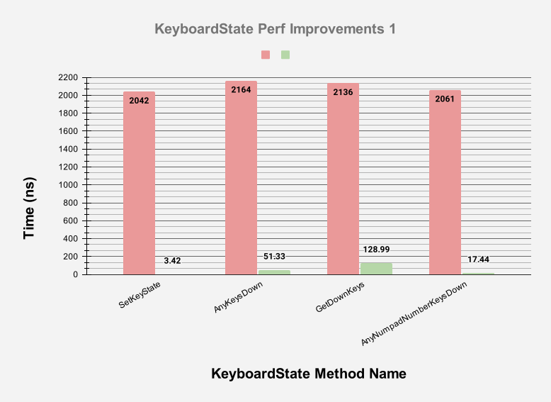
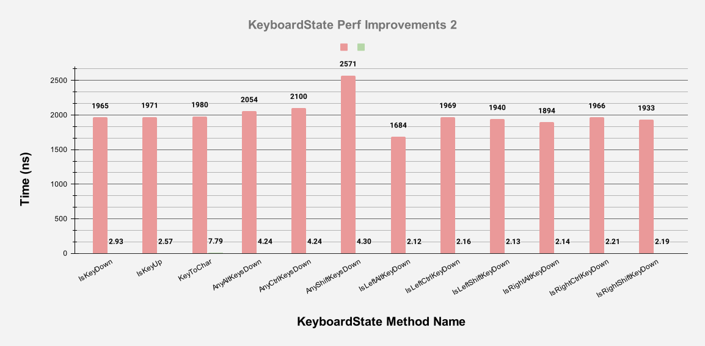
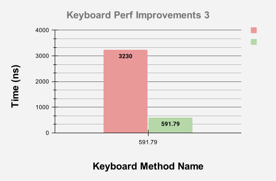

import URL from "@site/src/components/URL";

## Introduction

Welcome to the latest update on our exciting 2D game development framework <URL link='https://github.com/KinsonDigital/Velaptor' text='Velaptor'/>!
We're thrilled to announce that our newest release is now live which consists of some technical debt cleanup, updates to the CICD
system, and some other developer experience items, this release is all about performance.

{/*truncate*/}

When it comes to game development, performance is very important. With game development libraries it becomes even more
important than the development of the game itself. Why is this?  Game libraries such as game frameworks,
game engines, and other types of libraries used to develop games are developer tools. These tools are used directly in
the game and their performance characteristics directly affect the performance of the game. The more performant the library,
the more "bandwidth" you are giving to the game developer for each frame of the game.

This is why we will always take performance very seriously with Velaptor. We not only write code to be performant while
we develop new features and make changes, but we also will take the time to further improve existing features and systems
in Velaptor.

## Performance improvements

The performance improvements for this release are for the most part related to the keyboard input system.
When a game is built, you never know when the user will press a key or move the mouse. Because of this, you have to poll
for the state of the keyboard and mouse for every frame. Anything that ends up being executed as part of the game loop
can be a candidate for performance improvement or degradation.

Specifically, this release focuses on improvements in getting the state of the keyboard using the `Keyboard.GetState()`
method as well as the `KeyboardState` itself. The `KeyboardState` returned by the `GetState()` method mentioned above
also has been improved. The improvements involve not only how the state is collected but also reducing the memory
allocations that were occurring during the collection of the state.

When developing games with garbage-collected languages such as C#, you have to take memory allocations into account.
The more memory you allocate on the heap during the game loop, the more often your game could trigger garbage collection.

:::info NOTE
Garbage collection is a process that runs in the background of your application and cleans up memory that is no longer
being used. This process can be expensive when it comes to the time constraints of video games. This is not to say that
garbage collection is bad in video games, it is just that too many collections that affect the performance of YOUR game can
be problematic.
:::

C# is a great choice for game development and has a lot of successful 2D and 3D games that have been developed with it.

## Performance tools used

When it comes to collecting and measuring the performance of C# code, the best tool in my opinion that exists for this is
<URL link='https://github.com/dotnet/BenchmarkDotNet' text='BenchmarkDotNet'/>. This tool is used by the .NET team to
measure the performance of the .NET runtime and the .NET libraries. It is also used by many other open-source projects
to measure the performance of their code.

## Improvement results

The performance gains that were achieved were impressive. Though these gains might not be noticeable for some games, indeed
they would be for others. Remember, not all games are created equal and some games require more performance than others. As
mentioned before, these efforts matter because our goal is to not be the bottleneck for your game. The gains here are always
about and will always be about giving you more "bandwidth" to work with as well as reducing allocations.

It was important to improve these _**classes**_ and _**structs**_ because they are used in the game loop of 99% of games.
These types were great candidates for improvement.

The types that were improved were `KeyboardState`, `MouseState`, and `Keyboard`. When measuring performance, it is important to
get a good baseline before making any changes. So we created a <URL link="https://github.com/KinsonDigital/Velaptor/tree/preview/Performance/KeyboardPerf" text="performance project"/>
to accomplish this.

Baseline Performance Results

These are the baseline results for the `KeyboardState` and `Keyboard` types.

| Method                                  | Mean     | Memory Allocations |
|---------------------------------------- |---------:|-------------------:|
| KeyboardState.IsKeyDown                 | 1.965 us |             8.2 KB |
| KeyboardState.IsKeyUp                   | 1.971 us |             8.2 KB |
| KeyboardState.SetKeyState               | 2.042 us |             8.2 KB |
| KeyboardState.KeyToChar                 | 1.980 us |            8.25 KB |
| KeyboardState.GetDownKeys               | 2.136 us |            8.23 KB |
| KeyboardState.AnyAltKeysDown            | 2.054 us |             8.2 KB |
| KeyboardState.AnyCtrlKeysDown           | 2.100 us |             8.2 KB |
| KeyboardState.AnyShiftKeysDown          | 2.571 us |             8.2 KB |
| KeyboardState.AnyNumpadNumberKeysDown   | 2.061 us |            8.23 KB |
| KeyboardState.AnyStandardNumberKeysDown | 1.985 us |            8.23 KB |
| KeyboardState.IsLeftAltKeyDown          | 1.684 us |             8.2 KB |
| KeyboardState.IsLeftCtrlKeyDown         | 1.969 us |             8.2 KB |
| KeyboardState.IsLeftShiftKeyDown        | 1.940 us |             8.2 KB |
| KeyboardState.IsRightAltKeyDown         | 1.894 us |             8.2 KB |
| KeyboardState.IsRightCtrlKeyDown        | 1.966 us |             8.2 KB |
| KeyboardState.IsRightShiftKeyDown       | 1.933 us |             8.2 KB |
| Keyboard.GetState                       | 3.230 us |             8.2 KB |

As you can see, many games would probably be ok with these results if you had a simple game or more importantly did not have 
a lot of input-related code. The time unit of measurement here is in microseconds. A microsecond is 1 millionth of a second.
Though this might seem like a small amount of time, it can add up quickly. This of course depends on the type of game you are
building. There are other things in the game loop besides collecting the state of the keyboard and mouse.
You would be surprised how quickly those things can add up.

One way I like to think of it is that every frame is a "bandwidth" that you are working with. This helps put things into perspective
in regards to how certain parts of your game might affect everything else. If the game was running at 60 frames per second,
then you have 16.67 milliseconds to work with. If you were to convert this into microseconds, you would have 16,660 microseconds
to work with for the entire frame. That number does not sound so great when you could have many other things in your game
that need some of that frame bandwidth. Now if you were to get the performance down into the nanosecond range, then you would
have 16,660,000 nanoseconds to work with per frame.

Performance Results After Improvements

Here are the results after all of the improvements were made.

| Method                                  | Mean       | Allocated |
|---------------------------------------- |-----------:|----------:|
| KeyboardState.IsKeyDown                 |   2.926 ns |         - |
| KeyboardState.IsKeyUp                   |   2.570 ns |         - |
| KeyboardState.SetKeyState               |   3.417 ns |         - |
| KeyboardState.KeyToChar                 |   7.785 ns |         - |
| KeyboardState.GetDownKeys               | 128.989 ns |     104 B |
| KeyboardState.AnyAltKeysDown            |   4.244 ns |         - |
| KeyboardState.AnyCtrlKeysDown           |   4.240 ns |         - |
| KeyboardState.AnyShiftKeysDown          |   4.302 ns |         - |
| KeyboardState.AnyNumpadNumberKeysDown   |  17.443 ns |         - |
| KeyboardState.AnyStandardNumberKeysDown |  21.220 ns |         - |
| KeyboardState.IsLeftAltKeyDown          |   2.119 ns |         - |
| KeyboardState.IsLeftCtrlKeyDown         |   2.161 ns |         - |
| KeyboardState.IsLeftShiftKeyDown        |   2.128 ns |         - |
| KeyboardState.IsRightAltKeyDown         |   2.140 ns |         - |
| KeyboardState.IsRightCtrlKeyDown        |   2.210 ns |         - |
| KeyboardState.IsRightShiftKeyDown       |   2.188 ns |         - |
| Keyboard.GetState                       | 591.791 ns |    2752 B |

The results are impressive. Notice that the timescale has changed from 'us' to 'ns'. The acronym 'ns' stands for nanoseconds which
are 1 billionth of a second. This is a very small amount of time. At this scale, there are 16,660,000 nanoseconds in a
single frame. This is huge!!  Another thing to notice is the huge amount of reduction in memory allocations.

To help put this improvement into perspective, refer to the table below with the time scale of the baseline
converted into nanoseconds.

Performance Comparison (Time)

Processing time comparison before and after the improvements.

| Method                                  | Time Before | Time After | Perf Improvement |
|----------------------------------------:|------------:|-----------:|-----------------:|
| KeyboardState.IsKeyDown                 |     2042 ns |   2.926 ns |           99.83% |
| KeyboardState.IsKeyUp                   |     2164 ns |   2.570 ns |           97.63% |
| KeyboardState.SetKeyState               |     2136 ns |   3.417 ns |           93.96% |
| KeyboardState.KeyToChar                 |     2061 ns |   7.785 ns |           99.15% |
| KeyboardState.GetDownKeys               |     1965 ns | 128.989 ns |           99.85% |
| KeyboardState.AnyAltKeysDown            |     1971 ns |   4.244 ns |           99.87% |
| KeyboardState.AnyCtrlKeysDown           |     1980 ns |   4.240 ns |           99.61% |
| KeyboardState.AnyShiftKeysDown          |     2054 ns |   4.302 ns |           99.79% |
| KeyboardState.AnyNumpadNumberKeysDown   |     2100 ns |  17.443 ns |           99.80% |
| KeyboardState.AnyStandardNumberKeysDown |     2571 ns |  21.220 ns |           99.83% |
| KeyboardState.IsLeftAltKeyDown          |     1684 ns |   2.119 ns |           99.87% |
| KeyboardState.IsLeftCtrlKeyDown         |     1969 ns |   2.161 ns |           99.89% |
| KeyboardState.IsLeftShiftKeyDown        |     1940 ns |   2.128 ns |           99.89% |
| KeyboardState.IsRightAltKeyDown         |     1894 ns |   2.140 ns |           99.89% |
| KeyboardState.IsRightCtrlKeyDown        |     1966 ns |   2.210 ns |           99.89% |
| KeyboardState.IsRightShiftKeyDown       |     1933 ns |   2.188 ns |           99.89% |
| Keyboard.GetState                       |     3230 ns | 591.791 ns |           81.68% |

The average improvement of 98.25% across the board for keyboard input.

Memory Allocation Comparison

Memory allocation comparison before and after the improvements.

|  Method                                 | Before  | After   |
|----------------------------------------:|--------:|--------:|
| KeyboardState.IsKeyDown                 |  8.2 KB |     0 B |
| KeyboardState.IsKeyUp                   |  8.2 KB |     0 B |
| KeyboardState.SetKeyState               |  8.2 KB |     0 B |
| KeyboardState.KeyToChar                 | 8.25 KB |     0 B |
| KeyboardState.GetDownKeys               | 8.23 KB |   104 B |
| KeyboardState.AnyAltKeysDown            |  8.2 KB |     0 B |
| KeyboardState.AnyCtrlKeysDown           |  8.2 KB |     0 B |
| KeyboardState.AnyShiftKeysDown          |  8.2 KB |     0 B |
| KeyboardState.AnyNumpadNumberKeysDown   | 8.23 KB |     0 B |
| KeyboardState.AnyStandardNumberKeysDown | 8.23 KB |     0 B |
| KeyboardState.IsLeftAltKeyDown          |  8.2 KB |     0 B |
| KeyboardState.IsLeftCtrlKeyDown         |  8.2 KB |     0 B |
| KeyboardState.IsLeftShiftKeyDown        |  8.2 KB |     0 B |
| KeyboardState.IsRightAltKeyDown         |  8.2 KB |     0 B |
| KeyboardState.IsRightCtrlKeyDown        |  8.2 KB |     0 B |
| KeyboardState.IsRightShiftKeyDown       |  8.2 KB |     0 B |
| Keyboard.GetState                       |  8.2 KB |  2752 B |

For the methods that still cause allocations, the average improvement is an 82.60% decrease in memory allocations.
This would arguably be a bigger win vs the processing time improvements.

Performance Comparison Charts

These charts show the values in number form above each bar.  The performance
improvement is so great that the majority of the green bars do not visibly
register on the char.

## Performance improvement methods

How did we get these performance gains?  Well, after looking at how the `KeyboardState`
struct and `Keyboard` class were implemented, and we also noticed that some unnecessary
allocations were being done when collecting the state of the keyboard.  For every frame,
a new instance of the `KeyboardState` struct was created.  Internally in the
struct, the state of the keyboard was represented by a `Dictionary` of the keys
and the down state of each key.  This dictionary was lazily being created when any of the struct
methods were being invoked.  The original idea at the time of creation was that it would
only be created once but we failed to notice that the `KeyboardState` struct was being
constructed every single frame.

This means that the `Dictionary` was being constructed every frame.  To avoid this,
we created a service that continually gets updates to the state of the keyboard every frame
and since the total number of keyboard keys is known ahead of time, this means that we can
allocate the dictionary once and reuse it every frame.

We also improved and introduced static keyboard state data internally of the public API
which was used to understand if a key is a letter, modifier, number key, and so on.  Before,
allocations of an array were being used to "collect" all of the requested keys for processing.

Also, the `KeyboardState` struct dictionary is being allocated with a capacity that is known
upfront.  This means that the dictionary will not have to be resized as more keys are added
when setting the state of the keyboard in the struct.

All of these methods and more were used to help not only improve performance but also greatly
reduce memory allocations.

:::note Code changes
If you are interested in looking at how we improved the performance of the keyboard input system,
you can check out the <URL link="https://github.com/KinsonDigital/Velaptor/pull/849" text=" pull request here"/>.
:::

## Take Velaptor for a spin!

We invite you to check out the [release notes](https://github.com/KinsonDigital/Velaptor/releases/tag/v1.0.0-preview.31)
to inform yourself of the changes. Your feedback is invaluable to us. If you have any comments, questions, or suggestions,
please don't hesitate to open an issue on our [GitHub repository](https://github.com/KinsonDigital/Velaptor/issues/new/choose).
We're always looking to improve and your input helps us do just that.

Happy coding!

## Interested in contributing?

If you are interested in helping out, that would be great!!

Here are the ways you can contribute to [Velaptor](https://github.com/KinsonDigital/Velaptor) or the GitHub
[KinsonDigital](https://github.com/KinsonDigital) organization as a whole:

1. Contribute to the project via time:
    - You can offer your time and expertise by picking up issues and submitting pull requests
 with code improvements, bug fixes, or new features.
    - Contribute by providing feedback, reporting issues, or suggesting enhancements through GitHub issues.
2. If you would like to contribute financially, you can consider donating to the project or
sponsoring the project on the following platforms:
    like GitHub Sponsors.
    
    
Contributions via financial and/or investing your time are greatly appreciated and can help support the 
development and maintenance of all the [KinsonDigital](https://github.com/KinsonDigital) projects, as well
as cover expenses such as hosting and infrastructure costs.
