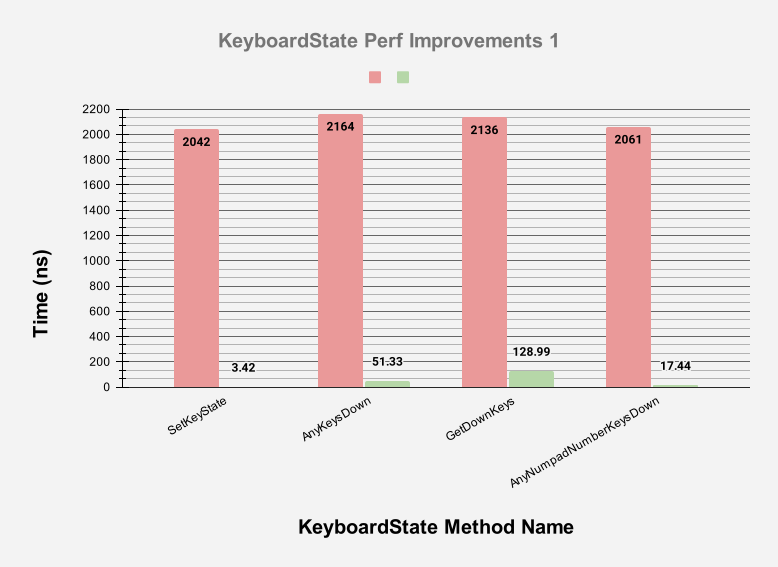
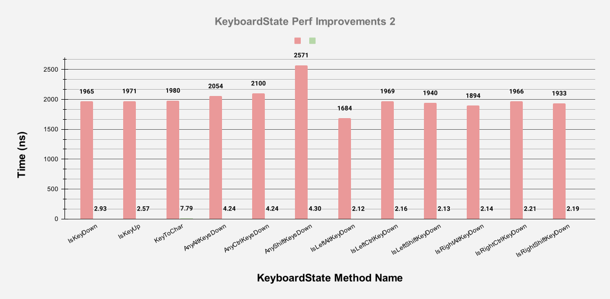
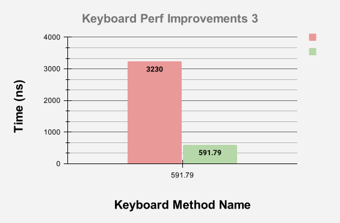

import URL from "@site/src/components/URL";
import JoinComm from "@site/src/components/JoinComm";
import GHUrl from "@site/src/components/GHUrl";
import ReleaseNotes from "@site/src/components/ReleaseNotes";
import GitHubProject from "@site/src/components/GitHubProject";
import PR from "@site/src/components/PR";
import Details from "@site/src/components/Details";

## New Velaptor Release

Welcome to the new exciting and latest update on our 2D game development framework <GitHubProject owner='KinsonDigital' projName='Velaptor'/>!
We're thrilled to announce that our newest release is now live which consists of some bug fixes, technical debt cleanup, updates
to the CICD system, deprecation of the UI controls API, and some other developer experience items.

But the most exciting part of this release is the performance improvements due to updating to dotnet 8 as well as vastly
improving the performance of the keyboard input system.

We invite you to check out the <ReleaseNotes projName="Velaptor" version="v1.0.0-preview.31"/>
to inform yourself of the changes.

A quick thanks to the following contributors for their contributions to this release:
- [@AndreBonda](https://github.com/AndreBonda)
- [@map-b](https://github.com/map-b)

We appreciate your help and support in making Velaptor better!

{/*truncate*/}

## Introduction

Imagine you're playing a game. The graphics are stunning, the storyline is captivating, and the gameplay is immersive.
But every few seconds, the game stutters. The frame rate drops, the controls become unresponsive, and the whole experience is ruined.
Frustrating, isn't it?

This is why performance is so important in game development. It's the invisible thread that weaves the entire gaming
experience together. And when it comes to game development libraries, performance isn't just important - it's critical.

Why, you ask? Game libraries are the tools that developers use to build games. They're the foundation upon which the entire
game is built. If the foundation is shaky, the whole structure suffers. The more performant the library, the more "room" a
game developer has to create a smooth and responsive game.

At <GitHubProject owner='KinsonDigital' projName='Velaptor'/>, we understand this.
We don't just write performant code - we live and breathe it. We're constantly looking for ways to improve, to squeeze out
every last drop of performance. Because we know that every millisecond counts. And we're committed to giving you, the game developer,
the best tools possible to create the best games possible.

So let's dive into the performance improvements in this release of Velaptor!

## Performance improvements

The performance improvements for this release are for the most part related to the keyboard input system.
When a game is built, you never know when the user will press a key or move the mouse. Because of this, you have to poll
for the state of the keyboard and mouse for every frame. Anything that ends up being executed as part of the game loop
can be a candidate for performance improvement or degradation.

Specifically, this release focuses on improvements in getting the state of the keyboard using the `Keyboard.GetState()`
method as well as the `KeyboardState` itself. The `KeyboardState` returned by the `GetState()` method mentioned above
also has been improved. The improvements involve not only how the state is collected but also reducing the memory
allocations that were occurring during the collection of the state.

When developing games with garbage-collected languages such as C#, you have to take memory allocations into account.
The more memory you allocate on the heap during the game loop, the more often your game could trigger garbage collection.

:::info A NOTE ABOUT GARBAGE COLLECTION
In game development, especially in languages like C# that use garbage collection, managing memory allocations is crucial.
Allocating too much memory during the game loop can trigger frequent garbage collections, which can negatively impact game performance.

The garbage collector cleans up memory that is no longer being used, but this process can be expensive in terms of time,
which is a critical resource in game development. Therefore, reducing memory allocations and managing them efficiently is
an important aspect of game development in C# or any other garbage-collected language.

This is not to say that garbage collection is bad in video games, it is just that too many collections that affect
the performance of YOUR game can be problematic.
:::

C# is a great choice for game development and has a lot of successful 2D and 3D game titles that have been developed with it.

## Performance tools used

When it comes to collecting and measuring the performance of C# code, the best tool in my opinion that exists for this is
<URL link='https://github.com/dotnet/BenchmarkDotNet' text='BenchmarkDotNet'/>. This tool is used by the .NET team to
measure the performance of the .NET runtime and the .NET libraries. It is also used by many other open-source projects
to measure the performance of their code.

## Improvement results

The performance gains that were achieved were impressive. Though these gains might not be noticeable for some games, indeed
they would be for others. Remember, not all games are created equal and some games require more performance than others. As
mentioned before, these efforts matter because our goal is to not be the bottleneck for your game. The gains here are always
about and will always be about giving you more "bandwidth" to work with as well as reducing allocations.

It was important to improve the _**classes**_ and _**structs**_ related to keyboard input because they are used in the
game loop of 99% of games. These types were great candidates and an easy win regarding performance improvements.

The types that were improved were `KeyboardState`, and `Keyboard`. When measuring performance, it is important to
get a good baseline before making any changes. So we created a <URL link="https://github.com/KinsonDigital/Velaptor/tree/preview/Performance/KeyboardPerf" text="performance project"/>
to accomplish this.

:::info Baseline Performance Results

These are the baseline results for the `Keyboard` and `KeyboardState` types.

| Method                                  | Mean     | Memory Allocations |
|---------------------------------------- |---------:|-------------------:|
| KeyboardState.IsKeyDown                 | 1.965 us |             8.2 KB |
| KeyboardState.IsKeyUp                   | 1.971 us |             8.2 KB |
| KeyboardState.SetKeyState               | 2.042 us |             8.2 KB |
| KeyboardState.KeyToChar                 | 1.980 us |            8.25 KB |
| KeyboardState.GetDownKeys               | 2.136 us |            8.23 KB |
| KeyboardState.AnyAltKeysDown            | 2.054 us |             8.2 KB |
| KeyboardState.AnyCtrlKeysDown           | 2.100 us |             8.2 KB |
| KeyboardState.AnyShiftKeysDown          | 2.571 us |             8.2 KB |
| KeyboardState.AnyNumpadNumberKeysDown   | 2.061 us |            8.23 KB |
| KeyboardState.AnyStandardNumberKeysDown | 1.985 us |            8.23 KB |
| KeyboardState.IsLeftAltKeyDown          | 1.684 us |             8.2 KB |
| KeyboardState.IsLeftCtrlKeyDown         | 1.969 us |             8.2 KB |
| KeyboardState.IsLeftShiftKeyDown        | 1.940 us |             8.2 KB |
| KeyboardState.IsRightAltKeyDown         | 1.894 us |             8.2 KB |
| KeyboardState.IsRightCtrlKeyDown        | 1.966 us |             8.2 KB |
| KeyboardState.IsRightShiftKeyDown       | 1.933 us |             8.2 KB |
| Keyboard.GetState                       | 3.230 us |             8.2 KB |

:::

Now, let's put these numbers into perspective. Imagine each frame as a "bandwidth" that you're working with.
This analogy can help us understand how different parts of your game might impact the overall performance. 

Consider a game running at 60 frames per second. This gives you a budget of 16.67 milliseconds for each frame.
When you convert that into microseconds, it's only 16,660 microseconds. That might seem like a lot, but it can add up quickly.

Suddenly, the time budget doesn't seem so generous, does it? Especially when you consider that your game might have
many other processes that need a slice of that frame bandwidth. 

But what if we could reduce the performance down to the nanosecond range? Then you'd have a whopping 16,660,000
nanoseconds to work with per frame. Now that's a number we can work with!

This is why every microsecond counts.

:::info Performance Results After Improvements

Here are the results after all of the improvements were made.

| Method                                  | Mean       | Allocated |
|---------------------------------------- |-----------:|----------:|
| KeyboardState.IsKeyDown                 |   2.926 ns |         - |
| KeyboardState.IsKeyUp                   |   2.570 ns |         - |
| KeyboardState.SetKeyState               |   3.417 ns |         - |
| KeyboardState.KeyToChar                 |   7.785 ns |         - |
| KeyboardState.GetDownKeys               | 128.989 ns |     104 B |
| KeyboardState.AnyAltKeysDown            |   4.244 ns |         - |
| KeyboardState.AnyCtrlKeysDown           |   4.240 ns |         - |
| KeyboardState.AnyShiftKeysDown          |   4.302 ns |         - |
| KeyboardState.AnyNumpadNumberKeysDown   |  17.443 ns |         - |
| KeyboardState.AnyStandardNumberKeysDown |  21.220 ns |         - |
| KeyboardState.IsLeftAltKeyDown          |   2.119 ns |         - |
| KeyboardState.IsLeftCtrlKeyDown         |   2.161 ns |         - |
| KeyboardState.IsLeftShiftKeyDown        |   2.128 ns |         - |
| KeyboardState.IsRightAltKeyDown         |   2.140 ns |         - |
| KeyboardState.IsRightCtrlKeyDown        |   2.210 ns |         - |
| KeyboardState.IsRightShiftKeyDown       |   2.188 ns |         - |
| Keyboard.GetState                       | 591.791 ns |    2752 B |

:::

The results are impressive. Notice that the timescale has changed from 'us' to 'ns'.
The acronym 'ns' stands for nanoseconds which are 1 billionth of a second. This is a very small amount of time.
This is huge!! Also, notice the huge amount of reduction in memory allocations.

To help put this improvement into perspective, refer to the comparison table below with the time scale of the baseline
converted into nanoseconds.

:::info Performance Comparison (Time)

Processing time comparison before and after the improvements.

| Method                                  | Time Before | Time After | Perf Improvement |
|----------------------------------------:|------------:|-----------:|-----------------:|
| KeyboardState.IsKeyDown                 |     2042 ns |   2.926 ns |           99.83% |
| KeyboardState.IsKeyUp                   |     2164 ns |   2.570 ns |           97.63% |
| KeyboardState.SetKeyState               |     2136 ns |   3.417 ns |           93.96% |
| KeyboardState.KeyToChar                 |     2061 ns |   7.785 ns |           99.15% |
| KeyboardState.GetDownKeys               |     1965 ns | 128.989 ns |           99.85% |
| KeyboardState.AnyAltKeysDown            |     1971 ns |   4.244 ns |           99.87% |
| KeyboardState.AnyCtrlKeysDown           |     1980 ns |   4.240 ns |           99.61% |
| KeyboardState.AnyShiftKeysDown          |     2054 ns |   4.302 ns |           99.79% |
| KeyboardState.AnyNumpadNumberKeysDown   |     2100 ns |  17.443 ns |           99.80% |
| KeyboardState.AnyStandardNumberKeysDown |     2571 ns |  21.220 ns |           99.83% |
| KeyboardState.IsLeftAltKeyDown          |     1684 ns |   2.119 ns |           99.87% |
| KeyboardState.IsLeftCtrlKeyDown         |     1969 ns |   2.161 ns |           99.89% |
| KeyboardState.IsLeftShiftKeyDown        |     1940 ns |   2.128 ns |           99.89% |
| KeyboardState.IsRightAltKeyDown         |     1894 ns |   2.140 ns |           99.89% |
| KeyboardState.IsRightCtrlKeyDown        |     1966 ns |   2.210 ns |           99.89% |
| KeyboardState.IsRightShiftKeyDown       |     1933 ns |   2.188 ns |           99.89% |
| Keyboard.GetState                       |     3230 ns | 591.791 ns |           81.68% |

:::

This results in an average improvement of 98.25% across the board for keyboard input.

Memory allocation comparison before and after the improvements.

|  Method                                 | Before  | After   |
|----------------------------------------:|--------:|--------:|
| KeyboardState.IsKeyDown                 |  8.2 KB |     0 B |
| KeyboardState.IsKeyUp                   |  8.2 KB |     0 B |
| KeyboardState.SetKeyState               |  8.2 KB |     0 B |
| KeyboardState.KeyToChar                 | 8.25 KB |     0 B |
| KeyboardState.GetDownKeys               | 8.23 KB |   104 B |
| KeyboardState.AnyAltKeysDown            |  8.2 KB |     0 B |
| KeyboardState.AnyCtrlKeysDown           |  8.2 KB |     0 B |
| KeyboardState.AnyShiftKeysDown          |  8.2 KB |     0 B |
| KeyboardState.AnyNumpadNumberKeysDown   | 8.23 KB |     0 B |
| KeyboardState.AnyStandardNumberKeysDown | 8.23 KB |     0 B |
| KeyboardState.IsLeftAltKeyDown          |  8.2 KB |     0 B |
| KeyboardState.IsLeftCtrlKeyDown         |  8.2 KB |     0 B |
| KeyboardState.IsLeftShiftKeyDown        |  8.2 KB |     0 B |
| KeyboardState.IsRightAltKeyDown         |  8.2 KB |     0 B |
| KeyboardState.IsRightCtrlKeyDown        |  8.2 KB |     0 B |
| KeyboardState.IsRightShiftKeyDown       |  8.2 KB |     0 B |
| Keyboard.GetState                       |  8.2 KB |  2752 B |

For the methods that still cause allocations, the average improvement is an 82.60% decrease in memory allocations.
This would arguably be a bigger win vs the processing time improvements.

:::info Performance Comparison Charts

These charts show the values in number form above each bar.  The performance
improvement is so great that the majority of the green bars do not visibly
register on the char.

:::

## How did we do it?

You might be wondering, how did we achieve such significant performance gains? Let's dive into the details.
We began with the `KeyboardState` struct and `Keyboard` class. We noticed some
unnecessary allocations happening every frame when collecting the keyboard state. A new instance of the `KeyboardState`
struct was being created for each frame, and within this struct, the keyboard state was represented by
a `Dictionary` of keys and the down state. This dictionary was lazily created whenever any of the struct methods were invoked. 

The original intention was to create the dictionary only once, but we overlooked the fact that the `KeyboardState`
struct was being constructed in every frame. This meant that the `Dictionary` was also being constructed every
frame, leading to constant reallocations. To tackle this, we introduced a singleton service that continually updates the
keyboard state every frame.

Since the total number of keyboard keys is known ahead of time, we pre-allocated the dictionary once and reused it every frame.
We also optimized and introduced static keyboard state data within the public API. These represent groups of
related keys such as letters, numbers, modifiers, and so on. Previously, allocations of an array were used to "collect"
all of the requested keys are for processing.

Moreover, the `KeyboardState` struct dictionary is now allocated with a known capacity upfront.
This means the dictionary doesn't need to be resized as more keys are added when setting the keyboard state in the struct.
These strategies, among others, not only improved performance but also significantly reduced memory allocations.

:::note Code changes
Curious about the nitty-gritty details? Feel free to explore the <PR projName="Velaptor" prNum="849" urlText="pull request here"/>
to see exactly how we improved the performance of the keyboard input system.
:::

## Join Our Community

<JoinComm />
