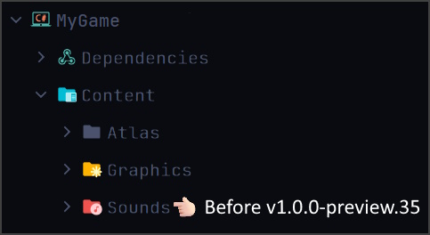
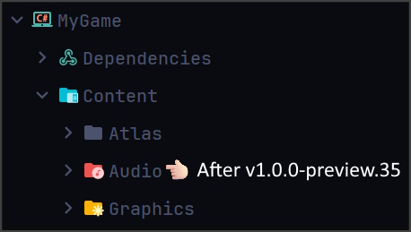

import URL from "@site/src/components/URL";
import GHProj from "@site/src/components/GHProj";
import ReleaseNotes from "@site/src/components/ReleaseNotes";
import JoinComm from "@site/src/components/JoinComm";
import Image from "@site/src/components/Image";

Hello again!! This release is a good one. 😉

## Quick Overview

This release contains various changes like a bug fix related to flipping images vertically and
horizontally, dependency updates, refactorings, code cleanup, and most importantly, the new stream audio
playback feature inherited from <GHProj owner="KInsonDigital" projName="CASL"/>.

The Velaptor release _**v1.0.0-preview.35**_ also contains breaking changes related to the public API.
These breaking changes are necessary and help solidify the public API before the version `v1.0.0` final release.

This release is a good one. 🤘🏻

:::info Release Notes
Check out the <ReleaseNotes projName="Velaptor" version="v1.0.0-preview.25"/>!!

If you are interested in seeing some of the features of _**Velaptor**_, check out the 
<URL link="https://www.youtube.com/watch?v=LxeVcUZw_WQ" text="Demo Video"/>!!

Quick shout out to the following contributors for their contributions to this release:
- Thanks <URL link="https://github.com/AndreBonda" text="@AndreBonda"/> for his contribution with <URL link="https://github.com/KinsonDigital/Velaptor/issues/868" text="issue #868"/>!
- Thanks <URL link="https://github.com/thestbar" text="@thestbar"/> for his contribution with <URL link="https://github.com/KinsonDigital/Velaptor/issues/783" text="issue #783"/>!
:::


Let's get into the details!!

## Bug Fix

The bug fix in this release is related to flipping images vertically and horizontally when using
the `ImageData` struct. If you were using a variable of type `ImageData` in the past where the creation
of the variable when using the default constructor or the `default` keyword, and you tried to flip
the image using the `FlipHorizontally()` or `FlipVertically()` methods, then you would get an exception.

Here is an example of the code that would throw an exception:

```csharp
// ImageData imgData = default; 👈🏻 or this
// var imgData = new ImageData(); 👈🏻 or this
var imgData = default(ImageData); 👈🏻 or this

imgData.FlipHorizontally(); 👈🏻 Would cause an exception
imgData.FlipVertically(); 👈🏻 Would cause an exception
```

## Dependency Updates

The main dependency update was an update to the latest version of <GHProj owner="KInsonDigital" projName="CASL"/>.
We will get into this later.

:::info CASL Release Notes
If you want the details, check out the <ReleaseNotes projName="CASL" version="v1.0.0-preview.18"/>.
:::

Another dependency update was upgrading <GHProj owner="KinsonDigital" projName="Carbonate"/> from version _**v1.0.0-preview.16**_ to _**v1.0.0-preview.18**_.


## Refactorings and Code Cleanup

As always, we are continuously looking for ways to improve the codebase. This release contains code cleanup in areas such
as the main Velaptor project, the unit tests, spelling and grammar throughout the code docs, and more.

The improvement of the code docs directly impacts the developer experience as well as on the <URL link="https://docs.velaptor.io/docs" text="API documentation"/>.


## API Changes

The breaking changes in this release are related to the public API. The changes are necessary to make the API more consistent,
easy to use, and as less confusing as possible.

### Removal of concrete loader types

This change is about being more opinionated and producing less confusion for the user when loading content.
Currently, the best and easiest way to load content is to use the `ContentLoaderFactory` to create
the content loaders. Use the desired loader throughout the lifetime of the scene and then use that loader to load that specific kind of content.

Let's show you an example:

```csharp
public override void LoadContent()
{
    // Most common way to load content
    this.textureLoader = ContentLoaderFactory.CreateTextureLoader();
    this.texture = this.textureLoader.Load("my-texture");
}
```

Another way that you "could" load content is by manually creating a loader object.

```csharp
public override void LoadContent()
{
  // Used to be able to do this, but not anymore
  this.textureLoader = new TextureLoader();
  this.texture = this.textureLoader.Load("my-texture");
}
```

We are getting close but have yet to reach _**v1.0.0**_. The _**NEED**_ for creating content loaders via constructors is not necessary, and it is better to have APIs closed and then opened up as needed for a good reason. This practice helps keep the API
more consistent, and reduce breaking changes.

### Sound class changes

1. We have changed the name of the `Sound` class to `Audio` and the `ISound` interface to `IAudio`. This change better reflects the purpose of the class as
well as better alignment with the latest version of the CASL library.

    ```csharp
    // Before v1.0.0-preview.35
    var music = new Sound("my-music.ogg");


    // After v1.0.0-preview.35
    this.audioLoader = ContentLoaderFactory.CreateAudioLoader();

    var music = this.audioLoader.Load("my-music.ogg", AudioBuffer.Stream);
    // or 
    var music = this.audioLoader.Load("my-music.ogg", AudioBuffer.Full);
    ```

2. We have also changed the data type of the `Position` and `Length` properties to `TimeSpan`. Using `TimeSpan` means using what is provided by dotnet instead
of creating and maintaining a type to represent time. The previous type, `SoundTime` was a type from _**CASL**_ and was not intended to be exposed or used
in _**Velaptor**_. The `TimeSpan` API data type provides more power and flexibility than the old `SoundTime` API.

3. We have replaced the `State` property from the `ISound` interface and `Sound` class with the following bool properties to represent the state of the audio.
    - `IsPlaying`
    - `IsPaused`
    - `IsStopped`
    - The `State` property was removed due to the unintentional exposure of the _**CASL**_ API.

    Here is an example of how to check the state of the audio before and after the changes:
    ```csharp
    // Before v1.0.0-preview.35
    var music = new Sound("my-music.ogg");
    var isPlaying = music.State == AudioState.Playing;
    var isPaused = music.State == AudioState.Paused;
    var isStopped = music.State == AudioState.Stopped;

    // After v1.0.0-preview.35
    this.audioLoader = ContentLoaderFactory.CreateAudioLoader();
    var music = this.audioLoader.Load("my-music.ogg", AudioBuffer.Stream);

    var isPlaying = music.IsPlaying;
    var isPaused = music.IsPaused;
    var isStopped = music.IsStopped;
    ```

4. We removed the `Reset()` method. The functionality provided by this method is the same as
the `Stop()` method and was unnecessary. Both methods existed when we first brought **CASL**_
into __**Velaptor**__. In the world of <URL link="https://openal.org/" text="OpenAL"/>,
there is a difference between the different operation types, and they were brought into the API
by mistake. When it comes to user expectations and experience, a single method is the better way to go.

5. We removed the `public` constructor from the `Audio` class. (it used to be `Sound`).
Removal reduces the number of different ways to load content further and keeps the API
opinionated and consistent.

### Naming Changes

We went through the entire code base, refactored all types and code docs using the terms `Sound`
and `Sounds`, and replaced them with `Audio`.
Here is a list of the naming changes we did on various types and methods:

1. Refactored the name of the `LoadSoundException` to `LoadAudioException`.

2. Refactored the name of the `SoundLoader` class to `AudioLoader`.

3. Refactored the name of the `PathResolverFactory.CreateSoundPathResolver()` method to `PathResolverFactory.CreateAudioPathResolver()`.

4. Refactored the name of the `ContentLoaderFactory.CreateSoundLoader()` method to `ContentLoaderFactory.CreateAudioLoader()`.

5. Refactored the `ILoader<IAudio>.Unload()` method parameter named `sound` to `audio`.

## Default Audio Content Folder

The default content folder name where _**Velaptor**_ will search for audio content has been
changed from `Sounds` to `Audio`. Again, as we get closer to `v1.0.0`, we are starting to make
changes that make more sense to how the entire library works and to the expectations of its users.



VS



## Performance Improvements

We have introduced a slight performance improvement to loading fonts. We discovered that the font
data was loading multiple times when it should not have been.

## Othe breaking changes

These changes relate to our effort to tighten up and improve the public API.

1. The name `LoadFontException` was renamed to `LoadFontException`.
2. We removed the `public` constructors from the `Texture` class.
3. We have removed the deprecated UI control API.
    - We recommend using ImgUi or another UI library or creating your UI, depending on your requirements.
4. We have removed the `width` and `height` parameters from the `ImageData` struct constructor.
    - The `width` and `height` parameters were unnecessary when creating an `ImageData` object.

## Conclusion

It is always a good feeling to release a new version of _**Velaptor**_!!

We have further solidified the public API, making it more consistent and easier to use. We have also
improved the codebase, fixed bugs, and made the library more performant.

That's it, everybody! What a good release! The introduction of the audio improvements
such as streaming, improvement on the public API, and other changes mentioned before, have been coming for a long time.

See you in the next release!!

## <span class="color-section">Join Our Community</span>

<JoinComm />
